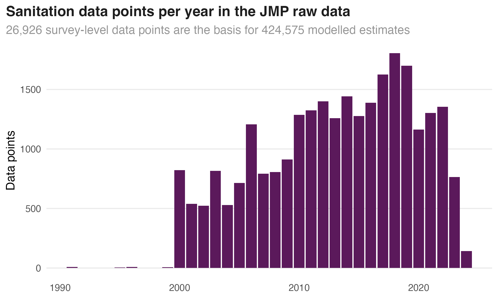

```{r}
#| include: false
library(dplyr)
data <- readr::read_csv(
  "pages/gallery/data/data_data/tbl-01-openwashdata-datasets.csv",
  show_col_types = FALSE
)
pub <- data |> filter(status == "published")
n_pub <- nrow(pub)
n_loc <- n_distinct(pub$location)
latest <- pub |>
  arrange(desc(date_published)) |>
  slice_head(n = 3)
card <- function(row) {
  htmltools::tags$a(
    class = "owd-card",
    href = row$link_pkg_website,
    htmltools::tags$span(
      class = "owd-card-kicker",
      paste(row$location, format(row$date_published, "%B %Y"), sep = ", ")
    ),
    htmltools::tags$strong(row$pkg_name),
    htmltools::tags$p(row$description)
  )
}
cards <- htmltools::tags$div(
  class = "owd-cards",
  lapply(seq_len(nrow(latest)), function(i) card(latest[i, ]))
)
```

::: {.owd-hero-b}
::: {.owd-section}

# <span class="owd-num">`r n_pub`</span> published data packages from <span class="owd-num">`r n_loc`</span> countries and regions

<p class="owd-lead">Water, sanitation and hygiene data, published by a community as documented, citable R data packages. Free to use, built to reuse.</p>

::: {.owd-chart}

<p class="owd-chart-title">Data packages published per year</p>

```{ojs}
raw = FileAttachment("pages/gallery/data/data_data/tbl-01-openwashdata-datasets.csv").csv({typed: false})
pub = raw.filter(d => d.status === "published" && d.date_published && d.date_published !== "NA")
top = ["Malawi", "Global"]
rows = pub.map(d => ({
  year: d.date_published.slice(0, 4),
  group: top.includes(d.location) ? d.location : "Other"
}))
order = ["Malawi", "Global", "Other"]
palette = ["#b04208", "#3EB489", "#272bd1"]
Plot.plot({
  width: Math.min(width, 760),
  height: 300,
  marginLeft: 36,
  marginTop: 24,
  style: {fontFamily: "Atkinson Hyperlegible Next, sans-serif", fontSize: 13, background: "transparent"},
  x: {label: null, tickSize: 0, type: "band"},
  y: {label: null, grid: true, ticks: 5},
  color: {domain: order, range: palette, legend: true},
  marks: [
    Plot.barY(rows, Plot.groupX({y: "count"}, {x: "year", fill: "group", order: order, insetTop: 2, tip: true})),
    Plot.text(rows, Plot.groupX({y: "count", text: "count"}, {x: "year", dy: -8, fill: "#1e1e1e", fontWeight: 700})),
    Plot.ruleY([0])
  ]
})
```

<p class="owd-chart-note">Hover a bar for the count per group. The full list is on the [data page](pages/gallery/data/index.qmd). When the owdata index is live, this chart reads it directly.</p>

:::

<form action="pages/gallery/data/index.qmd" method="get" class="owd-search" role="search">
<input type="search" name="q" placeholder="Search the datasets: a country, a topic, a package">
<button type="submit">Search</button>
</form>

::: {.owd-chips}
[Malawi](pages/gallery/data/index.qmd) [Global](pages/gallery/data/index.qmd) [Ghana](pages/gallery/data/index.qmd) [Kenya](pages/gallery/data/index.qmd) [Uganda](pages/gallery/data/index.qmd) [Brazil](pages/gallery/data/index.qmd)
:::

:::
:::

::: {.owd-section}

## Newest packages

```{r}
cards
```

[See all `r n_pub` datasets](pages/gallery/data/index.qmd){.owd-more}

:::

::: {.owd-tint}
::: {.owd-section}

## Dataset of the month

::: {.owd-dotm}
::: {.owd-dotm-text}
**jmpdata** holds the sanitation data behind the WHO/UNICEF Joint Monitoring Programme estimates: 26,926 survey data points and 424,575 modelled estimates for 232 countries and territories.

[Open jmpdata](https://openwashdata.github.io/jmpdata){.owd-more}
:::

:::

:::
:::

::: {#subscribe .owd-band}
::: {.owd-band-inner}

## The monthly data digest

<p>One dataset, one story from the community, and what is new. Once a month, nothing more.</p>

<form action="https://buttondown.com/api/emails/embed-subscribe/openwashdata" method="post" class="owd-subscribe">
<label for="owd-email-band">Your email</label>
<input type="email" name="email" id="owd-email-band" placeholder="your email address" required>
<input type="submit" value="Subscribe">
</form>

:::
:::

::: {.owd-section}
::: {.owd-strip}
::: {.owd-strip-col}

## Read

::: {#latest-posts}
:::

[All posts](pages/blog/index.qmd){.owd-more}

:::
::: {.owd-strip-col}

## Events

::: {#recent-events}
:::

[All events](pages/events/index.qmd){.owd-more}

:::
:::
:::

::: {.owd-tint}
::: {.owd-section}

## Join

```{=html}
<div class="owd-cards">
<a class="owd-card" href="pages/get-started/chat/index.qmd"><span class="owd-card-kicker">Talk</span><strong>Chat with us</strong><p>The community room on Matrix, open to everyone.</p></a>
<a class="owd-card" href="pages/blog/posts/2024-05-17-data-publication-1/index.qmd"><span class="owd-card-kicker">Share</span><strong>Publish your data</strong><p>We turn your WASH dataset into a documented, citable data package with you.</p></a>
<a class="owd-card" href="pages/academy/index.qmd"><span class="owd-card-kicker">Learn</span><strong>Take the course</strong><p>ds4owd, free and online: data science in R for WASH professionals.</p></a>
</div>
```

:::
:::

<div class="owd-bar-spacer"></div>

<div class="owd-bottom-bar">
<form action="https://buttondown.com/api/emails/embed-subscribe/openwashdata" method="post" class="owd-subscribe">
<label for="owd-email-bar">Get the monthly data digest</label>
<input type="email" name="email" id="owd-email-bar" placeholder="your email address" required>
<input type="submit" value="Subscribe">
</form>
</div>
